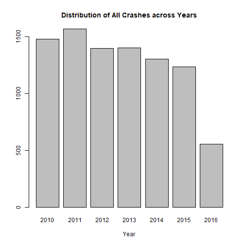
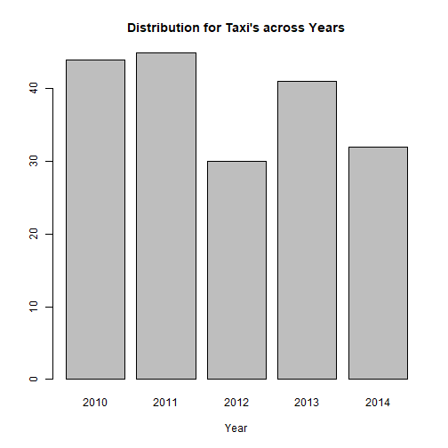

Analyze Crash Data in Cambridge, MA 
========================================================
author: Elizabeth Storm
date: January 24, 2019
autosize: true

Overview:
========================================================

Say you are moving to Cambridge, MA or already live there. What should be your route to work?

- Probably should avoid that intersection that has tons of crashes.

Maybe you are in charge of the police departement. Where should you send patrol cars? 

- Probably want to monitor that intersection that has tons of crashes.

Either situation you'll want to analyze the crash data over the past several years. This tool is for you! 

Summary of tool functions
========================================================
This tool will allow you to explore crash data from Cambridge:

- By Type of Vehicle
- Looking at Maps
- Across Years

Example:
========================================================
Say you want to see the trend in crashes over time:

Looks like it has been coming down over time for the city. Good news if you are the police chief. 

Example (continued)
========================================================
But you want to see it just for taxi's. 

Looks a bit more flat. So maybe watch out for those taxi's. 
